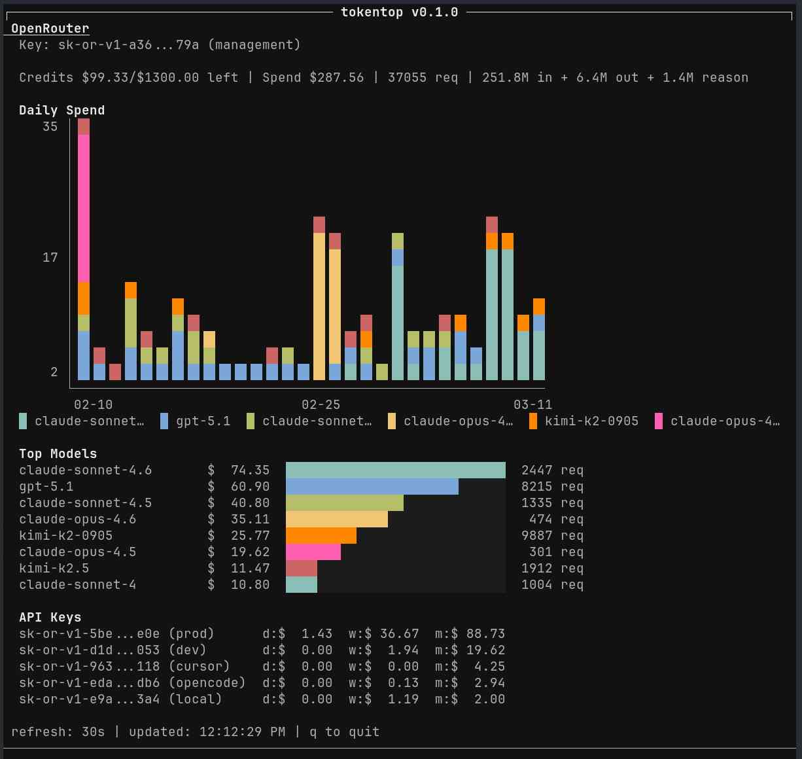
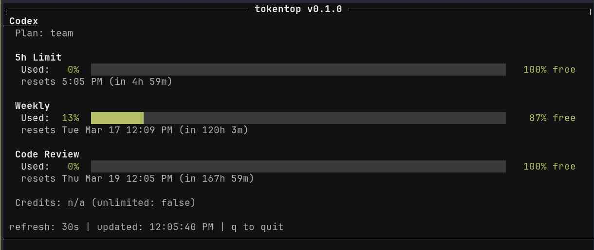

# tokentop

[](https://github.com/lwlee2608/tokentop/actions/workflows/ci.yml)

A terminal dashboard for monitoring your API usage in real time. Supports [OpenAI Codex](https://chatgpt.com/codex) and [OpenRouter](https://openrouter.ai/).





## Install

```sh
git clone https://github.com/lwlee2608/tokentop.git
cd tokentop
make install
```

This installs the binary to `~/.local/bin/tokentop`.

## Prerequisites

- **Codex**: An active Codex session with auth credentials at `~/.codex/auth.json` (created automatically when you use [Codex CLI](https://github.com/openai/codex)).
- **OpenRouter**: Set `OPENROUTER_API_KEY` environment variable. A management key is required for activity and credit details.

## License

MIT
