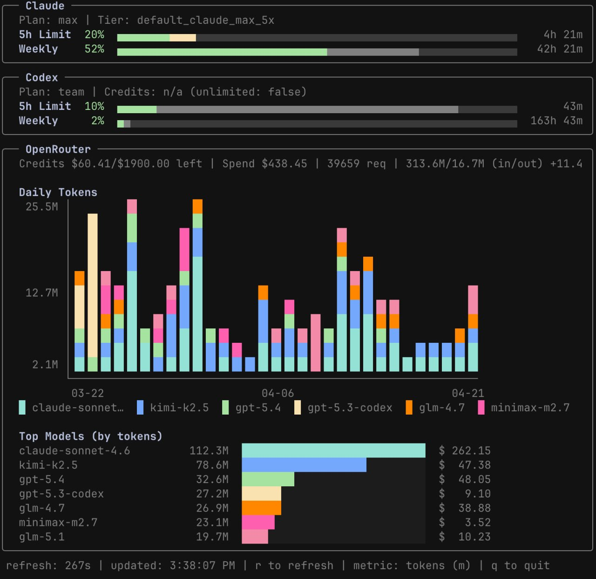

# tokentop

[](https://github.com/lwlee2608/tokentop/actions/workflows/ci.yml)
[](https://github.com/lwlee2608/tokentop/releases/latest)
[](https://goreportcard.com/report/github.com/lwlee2608/tokentop)
[](https://github.com/lwlee2608/tokentop/blob/main/go.mod)
[](LICENSE)

A terminal dashboard for monitoring your API usage in real time. Supports [Claude Code](https://claude.com/claude-code), [OpenAI Codex](https://chatgpt.com/codex), and [OpenRouter](https://openrouter.ai/).



## Install

```sh
curl -fsSL https://raw.githubusercontent.com/lwlee2608/tokentop/main/install.sh | sh
```

Or build from source:

```sh
git clone https://github.com/lwlee2608/tokentop.git
cd tokentop
make install
```

Both methods install the binary to `~/.local/bin/tokentop`. Override with `PREFIX=/usr/local`.

## Prerequisites

- **Claude**: An active Claude Code session — credentials are picked up automatically from the macOS Keychain (`Claude Code-credentials`) or `~/.claude/.credentials.json` after you sign in with [Claude Code](https://claude.com/claude-code).
- **Codex**: An active Codex session with auth credentials at `~/.codex/auth.json` (created automatically when you use [Codex CLI](https://github.com/openai/codex)).
- **OpenRouter**: Set `OPENROUTER_API_KEY` environment variable. A management key is required for activity and credit details.

## Documentation

- [Configuration](docs/configuration.md) — every config field, defaults, and examples
- [Providers](docs/providers.md) — how Codex, OpenRouter, and Claude credentials are detected
- [Keybindings & CLI flags](docs/keybindings.md)
- [Troubleshooting](docs/troubleshooting.md)

## License

MIT
